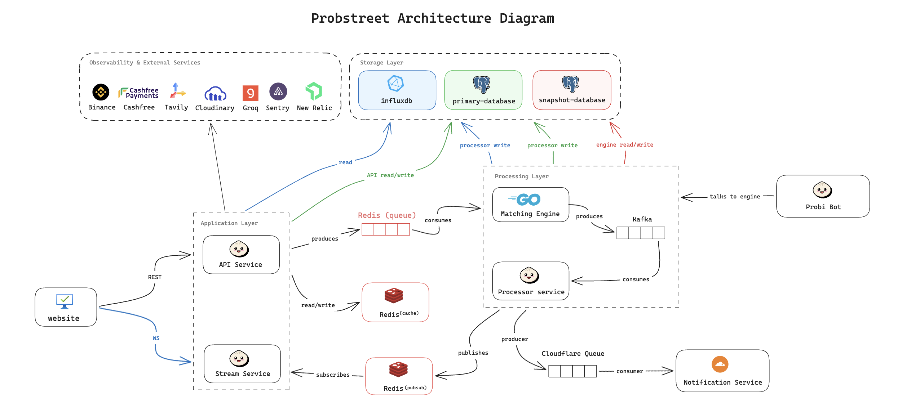

# Probstreet

**A prediction market platform built from scratch.**

Hola a todos! 👋 I'm Rehan, a self-taught engineer who loves reverse-engineering real products to understand how they work under the hood — from the APIs and system design to the deep internals. This is the story of how a late-night curiosity turned into a fully-featured trading platform.

---

## The Story Time

It started with a YouTube video.

My mentor, Harkirat Singh, put out a video explaining Probo — an Indian opinion trading platform where users could trade on the outcomes of real-world events. I was immediately fascinated.

What is the engineering behind something like this? How do you match thousands of orders per second without running into race conditions? How do you handle money when every millisecond matters?

At the time, Harkirat was also launching his first on-site cohort and was planning to build a project inspired by Probo as part of it. I watched his video explaining how the platform worked at a high level, and that curiosity stuck with me.

I didn't start building it immediately.

A little later, I came back to the idea and decided to figure out how the actual product worked under the hood. I opened up the browser's network tab, and started watching requests fly across the screen. I reverse-engineered the APIs, studied the request and response shapes, traced how different parts of the application communicated, and started rebuilding the APIs myself.

I also went through Probo's blog posts and other publicly available material to understand not just what the platform was doing, but why it was built that way and what technologies and architectural ideas were behind it.

Eventually, I had built a working version of the core experience — the APIs, UI, and major features — largely by taking the real product apart and rebuilding it piece by piece.

Then, one late night while I was working on one of the project's APIs, my uncle called me around 1 AM.

He told me that Probo had been shut down in India due to regulatory issues.

I remember thinking, well... there goes the product I'm trying to reverse-engineer.

I stopped working on the project and moved on to other things — different side projects, learning, and eventually my office work. The Probo project sat there unfinished, becoming one of those projects I kept telling myself I'd come back to someday.

---

Fast-forward a few months.

I had some free time, but the idea of Probo never really left my mind. I kept thinking about the same question: _if I were to build this again, how would I do it properly?_

So I went deeper.

I started looking beyond Probo and studying other prediction-market platforms like **Kalshi**, **Polymarket**, and **PredictStreet**, an official FIFA partner. I spent hours in the network tab, tracing requests, inspecting payloads, and trying to understand what was happening behind every interaction.

How are markets structured? How are orders created and matched? How does the system handle real-time updates? What happens when a market resolves? How is settlement handled? And, most importantly, how do you design all of this so the system remains consistent when thousands of users are interacting with it at the same time?

What started as _“let me understand how this works”_ slowly turned into _“I think I can build this properly.”_

So I went back to the drawing board.

This time, I wasn't trying to clone Probo. I wanted to take everything I had learned from reverse-engineering these platforms and build my own version from scratch — **Probstreet**.

And this time, it wasn't just a reverse-engineering experiment.

It was going to be a real paper-trading product.

Throughout this process, I used **[Antigravity](https://antigravity.dev)**, an advanced AI coding agent, to help architect, debug, and developed the complex parts of the system.

---

## Engineering Behind Probstreet

### Mad Matching Engine

The first decision was language. The core matching logic had to live in Go. Not because it's trendy, but because:

- Goroutines are cheap and give per-market concurrency without thread pools.
- Go's garbage collector latency is measurable in microseconds, not milliseconds.
- The type system keeps the financial invariants honest.

But here's what makes Probstreet's engine genuinely interesting: **it uses synthetic matching**.

In a regular limit order book, you can only match a Yes-Buy against a Yes-Sell. In a binary market, there's a smarter way. If nobody is selling Yes shares, but someone is bidding ₹4 for No shares — then you can _synthesize_ a Yes trade at ₹6 (since ₹4 + ₹6 = ₹10, the total payout). The engine supports:

- **Standard matching** — direct Yes vs Yes, No vs No.
- **Mint matching** — a new pair of Yes+No shares is created when both sides want to enter the market.
- **Merge matching** — a holder of Yes and No shares exits the market together, cancelling each other out.

This is significantly harder to implement correctly. The matching algorithm has to consider all four order types (Yes/No × Buy/Sell) and pick the best counterparty — comparing direct matches against synthetic equivalents by effective price, breaking ties by timestamp. The engine processes all of this with a per-market `sync.Mutex`, so different markets run fully concurrently without any global lock.


### Engine Snapshotting — Designing Around Constraints

The matching engine is intentionally stateful.

For speed, the active orderbooks, balances, and other engine state live in the Go process's memory. That gives the engine extremely fast access to the state it needs while matching orders.

But it immediately creates a problem:

**What happens when the process crashes?**

RAM is fast, but it's volatile. If the engine goes down, everything that exists only in memory disappears with it.

My first instinct was straightforward: persist periodic snapshots to object storage.

If I were deploying the system purely based on architecture, **Amazon S3** would have been the obvious choice. The backend was originally planned around AWS, and S3 is a natural fit for storing serialized engine snapshots.

But this project had another constraint: **I was building it without a large infrastructure budget.**

So I started comparing the options rather than blindly choosing the "standard" solution.

I looked at **Cloudflare R2** as well. One of the things that stood out was its lack of egress fees, which can matter when snapshots are frequently downloaded during recovery or across environments. R2's free tier also made it attractive for a project at this stage.

The only catch was that even using the free tier required adding a payment method, which became another constraint for me. So I went one layer deeper.

#### What if the database could store the snapshots?

PostgreSQL supports binary data through the `BYTEA` type. Instead of uploading every snapshot to an object-storage bucket, I could serialize the engine state into a compact binary representation and store the resulting bytes directly in PostgreSQL.

At first, this sounds like a compromise.

But then I did the math.

The database instance I was using had **500 MB of storage**, so the real question wasn't _"Is storing binary snapshots in Postgres architecturally perfect?"_

It was:

**"How much engine state can I actually fit into 500 MB?"**

That calculation changed the decision.

Assuming approximately **56 bytes per order** and **24 bytes per user**, a single latest snapshot could theoretically represent:

- **~9.36 million open orders** if the entire 500 MB were allocated to orders.
- **~21.85 million active users** if the entire 500 MB were allocated to users.

Obviously, a real engine state contains much more than those two structures, so those numbers aren't production capacity guarantees. They're useful bounds for understanding the storage constraint.

With a more realistic allocation of roughly **10% for users and 90% for the orderbook**, the same 500 MB could theoretically accommodate around:

- **~2 million active users** → ~48 MB
- **~8.4 million resting orders** → ~470 MB

I also compared binary storage with a more verbose representation such as JSONB. Because the engine state can be serialized into a compact binary format, `BYTEA` gives substantially better storage density for this particular workload.

#### What about keeping snapshot history?

The next question was how often to snapshot and whether to retain old snapshots.

If I take a snapshot every **10 minutes** and retain **24 hours** of history, that's:

**6 snapshots/hour × 24 hours = 144 snapshots**

At 500 MB total:

**500 MB / 144 ≈ 3.47 MB per snapshot**

That gives roughly **3.47 MB of storage per snapshot**.

Using the same simplified assumptions, a snapshot of that size could represent approximately:

- **20,000 active users** → ~480 KB
- **56,000 resting orders** → ~3.13 MB

Again, these are capacity calculations rather than guarantees. Real serialized state will contain additional metadata and data structures.

#### The more interesting bottleneck

And this is where the analysis became more interesting.

The database wasn't actually the first thing I needed to worry about.

The matching engine itself keeps the active state **in RAM**.

So even if PostgreSQL could comfortably store millions of orders in snapshots, the Go process still has to hold those orders in memory while the engine is running.

And in Go, the in-memory representation is not simply:

`number of orders × serialized bytes`

Maps, slices, pointers, object headers, indexes, heap allocations, and garbage-collector overhead all add to the real memory footprint.

So a theoretical **8.4 million orders** might fit inside the database snapshot calculation, while the live Go process could require **hundreds of megabytes to well over a gigabyte of RAM**, depending on the actual data structures and implementation.

That means the practical bottleneck isn't necessarily the 500 MB database limit.

**It's the memory required by the live matching engine.**

#### Why I chose PostgreSQL for now

So the final architecture became a deliberate trade-off.

Instead of immediately adding S3 or R2 to the infrastructure, I could use PostgreSQL `BYTEA` for serialized snapshots, keep the architecture simple, and avoid introducing another paid infrastructure dependency while the product was still being built.

The important part wasn't that PostgreSQL was somehow better than object storage.

It wasn't.

**The important part was choosing the architecture based on the actual constraints of the project.**

At production scale, I'd move large snapshot artifacts to object storage such as S3 or R2 and keep the database responsible for metadata, versions, checksums, and recovery pointers.

For the current stage of Probstreet, however, PostgreSQL gave me something more valuable:

**a simple, inexpensive recovery mechanism that was good enough for the scale I was targeting.**

### The Probi Bot — Liquidity From Day One

An empty orderbook is a dead product. When a new market is created, there's nobody on either side. No liquidity, no trades, no engagement.

To solve this, I built **Probi** — an internal market-maker bot. When a new market goes live, Probi automatically places spread orders on both the Yes and No sides at multiple price levels. This ensures that from minute one, any user who comes in has a counterparty to trade against. Markets feel alive immediately.

Probi operates like a market maker: it quotes both sides, earns the spread, and dynamically adjusts its positions as the real order flow comes in.

### The Resolution Pipeline — How Markets Get Resolved

This was the hardest engineering problem in the entire project. When a market expires — _"Will BTC touch $70k today?"_ or _"Will India beat Pakistan?"_ — something needs to determine the winning side. Reliably. Without human intervention at scale. Getting this wrong means settling money incorrectly.

Here's the full evolution of how I designed and iterated on this system:

#### Phase 1 — Manual Admin Resolution

The first version was the simplest thing that could work: an admin dashboard where a human checks the real-world result and clicks Resolve Yes or Resolve No. This works when you have 5 markets. It breaks when you have 500. So we need a better approach to handle this.

#### Phase 2 — Exploring On-Chain Oracles & Third-Party Webhooks

I researched how Polymarket and adipredictstreet handle resolution. Both rely on **Chainlink** — a decentralized oracle network that brings off-chain data on-chain. The idea is elegant: an independent network of nodes agrees on the truth, and smart contracts settle automatically.

But Probstreet runs **entirely off-chain**. Using Chainlink would mean paying gas fees for a system that has no blockchain settlement layer. It would add cost and complexity for zero architectural benefit.

So I looked for an off-chain equivalent. I considered **Make.com** — a no-code automation platform. The idea was: Make.com would monitor the source of truth, detect when an event concluded, and hit our API as a webhook to trigger settlement. In theory, clean and hands-off. In practice, three problems killed it:

1. **Single point of trust** — The most critical operation in the platform (resolving markets and settling money) would depend entirely on a third-party automation tool.
2. **Fragile data extraction** — If the source website changes its HTML structure, response format, or API contract, the Make.com scenario silently breaks.
3. **Latency and reliability** — No SLA guarantees for time-sensitive financial operations.

#### **Phase 3 — The In-House AI Pipeline (Tavily + Groq)**

I decided the resolution system had to be entirely in-house. The architecture: when a market's `endTime` passes, a cron job picks it up and runs it through a **resolution pipeline**.

But the core challenge remained: how do you programmatically determine if _"Will Elon Musk tweet about Dogecoin this week?"_ happened or not? There's no structured API for that.

The answer was combining **Tavily** (real-time web search with structured results) and **Groq** (fast LLM inference via their `openai/gpt-oss-120b` model at `temperature: 0.1` for determinism) into a pipeline. But I didn't trust raw LLM output — models hallucinate. Instead, I built a **rubric-based scoring system** where the AI must evaluate evidence against five explicit criteria:

| Criterion        | Max Score | What It Measures                                                 |
| ---------------- | --------- | ---------------------------------------------------------------- |
| Event Completion | 25        | Has the event definitively concluded?                            |
| Source Authority | 20        | Is the evidence from an official/authoritative source?           |
| Rule Match       | 25        | Does the outcome satisfy the market's specific YES/NO condition? |
| Data Clarity     | 20        | Is the relevant data (score, price, result) unambiguous?         |
| Corroboration    | 10        | Do multiple sources agree?                                       |

The rubric produces a score from 0–100. **Only if the total score is ≥ 90 AND the verdict is not `INCONCLUSIVE`**, the market auto-resolves. Below that threshold, the market is flagged as `AWAITING_ADMIN` and an admin notification is dispatched. Every resolution attempt — success or failure — is logged to an `OracleLog` table with the full rubric breakdown, raw evidence, and reasoning for complete auditability.

#### **Phase 4 — Deterministic Resolution (No AI Required)**

While studying PredictStreet and Kalshi's network traffic, I noticed their live trackers. PredictStreet uses polling for sports and WebSockets for crypto; Kalshi polls for both. This made me realize something important: **for quantitative markets with structured data APIs, AI is unnecessary overhead.**

If the market question is _"Will BTC touch $95k?"_, I don't need an LLM to parse web pages. I can call the Binance API, get the price, and compare it against the target. Zero hallucination risk.

This led to a split architecture — **three dedicated resolver crons**, each optimized for its data source:

**Crypto Resolver** (runs every 15 seconds):

- Fetches live prices from **Binance** (`/api/v3/ticker/price`) — the world's most liquid exchange.
- Supports **14 trading pairs** (BTC, ETH, SOL, XRP, DOGE, BNB, ADA, AVAX, LINK, DOT and their aliases).
- Handles two market types: **TOUCH** (did the price ever reach the target?) and **DIRECTION** (is the price above/below the start price at expiry?).
- For TOUCH markets, I built a **Wick Guard** — a confirmation mechanism that requires the price to stay past the target for **2 consecutive checks within a 30-second window** before resolving. This prevents false triggers from exchange wicks (momentary price spikes caused by thin liquidity).

**Sports Resolver** (runs every 1 minute):

- Polls **football-data.org** API with match-specific endpoints.
- Only starts polling within 15 minutes of the scheduled start time to avoid wasting API calls.
- Respects the provider's **10 requests/minute** rate limit by inserting 6-second delays between sequential match checks.
- Resolves deterministically once the match status is `FINISHED` — comparing home/away scores against the market condition (`home_win`, `away_win`, `draw`).

**Stocks Resolver** (runs every 1 minute):

- Fetches real-time quotes from **Finnhub** (`/api/v1/quote`).
- Extracts ticker symbols from the market's `sourceOfTruth` URL or falls back to regex extraction from the market title.
- Supports the same TOUCH/DIRECTION mechanics as crypto.

All three deterministic resolvers share a critical safety mechanism: **atomic resolution locking**. Before settling any market, the resolver calls `tryAcquireResolve()`, which performs an atomic `UPDATE ... WHERE status = 'OPEN'` — a compare-and-swap (CAS) operation at the database level. If two resolver instances race on the same market, only one acquires the lock. If the subsequent queue push fails, the lock is rolled back to `OPEN`. This guarantees **exactly-once settlement** even under concurrent execution.

**The General Oracle Pipeline** (runs every 1 minute):

- Catches all markets that don't have a dedicated deterministic resolver.
- First attempts to fetch the market's `sourceOfTruth` URL. If the response is JSON and a deterministic resolver config exists (e.g., `json_compare`), it resolves without AI.
- If no structured data is available, it falls back to Tavily search → Groq AI evaluation → rubric scoring.
- Crypto markets are explicitly excluded from this pipeline — they are always handled by the dedicated crypto cron to avoid unnecessary AI costs.

```text
Market Expiry Detected (cron)
        │
        ├── Crypto market? ──→ Crypto Resolver (Binance, every 15s)
        │                        ├── TOUCH → Wick Guard (2 confirms in 30s) → RESOLVED ✓
        │                        └── DIRECTION → Compare at expiry → RESOLVED ✓
        │
        ├── Sports market? ──→ Sports Resolver (football-data.org, every 1m)
        │                        └── Match FINISHED? → Score comparison → RESOLVED ✓
        │
        ├── Stocks market? ──→ Stocks Resolver (Finnhub, every 1m)
        │                        ├── TOUCH → Price vs target → RESOLVED ✓
        │                        └── DIRECTION → Compare at expiry → RESOLVED ✓
        │
        └── General market ──→ Oracle Pipeline (every 1m)
                 │
                 ├── sourceOfTruth JSON + deterministic config? → RESOLVED ✓
                 │
                 └── Fallback:
                      ├── Tavily web search (evidence gathering)
                      ├── Groq AI evaluation (rubric-based, 5 criteria)
                      │    ├── Score ≥ 90 → RESOLVED ✓
                      │    └── Score < 90 → AWAITING_ADMIN (notification sent)
                      └── Full audit log written to OracleLog table
```

### Rate-Limit Protection — Redis Cache Layer for Live Data

Every live data fetch — whether for the trading UI or for resolution — goes through a **Redis caching layer** with per-provider TTLs tuned to their rate limits and data freshness requirements:

| Provider                   | TTL            | Reasoning                                           |
| -------------------------- | -------------- | --------------------------------------------------- |
| Binance (crypto)           | **3 seconds**  | Prices move fast, Binance has generous rate limits  |
| Finnhub (stocks)           | **5 seconds**  | Moderate rate limits, prices update less frequently |
| football-data.org (sports) | **15 seconds** | Strict 10 req/min limit, match state changes slowly |

The first request for a market's live data fetches from the provider and writes to Redis. All subsequent requests within the TTL window are served from cache. This means even with thousands of concurrent users watching the same BTC market, Binance sees at most **one request every 3 seconds** from our system.

### Real-Time Live Match Tracker & Crypto Feeds

Building the resolution pipeline with dedicated data provider integrations created an opportunity: if we already have real-time data flowing through the system, why not surface it directly in the trading UI?

I built a **Live Match Tracker** that embeds real-time data directly into the market's trading interface, differentiated by market type:

- **Crypto markets** — The live data endpoint fetches Binance's 24-hour ticker (`/api/v3/ticker/24hr`), showing current price, 24h change percentage, and high/low range alongside the market's target price. Coin logos are mapped from a static registry.
- **Sports markets** — Polls football-data.org for live match state including minute-by-minute scores, team crests, match status (LIVE / HT / FINISHED / UPCOMING), and competition name. The parser normalizes responses across multiple API response shapes for compatibility.
- **Stock markets** — Fetches Finnhub real-time quotes showing current price, daily change, and high/low.

All live data responses flow through the same Redis cache layer described above, so the live tracker and the resolution pipeline share cached data — no duplicate API calls.

### Price Alerts — One-Shot Notification System

Users can set price alerts on any market for either the Yes or No side. The implementation uses a **cron-based polling approach** (every 50 seconds) rather than in-memory evaluation, which keeps the system simple and stateless:

1. The cron fetches all active alerts with their associated market prices and user notification preferences.
2. For each alert, it compares the market's current `yesPrice` or `noPrice` against the user's `targetPrice`.
3. If the threshold is crossed, it checks whether the user still holds a position in that market (no point alerting someone who's already exited).
4. If the user has holdings, a notification is dispatched through the notification service (supporting FCM push and email based on the user's `notificationPrefs`).
5. The alert is then **deactivated** — alerts are one-shot by design. If a user wants to be alerted again, they set a new one.

This one-shot model avoids alert fatigue (repeated notifications as the price oscillates around the threshold) and keeps the database clean — inactive alerts are never re-evaluated.

### Leaderboard — Redis Sorted Sets with Lazy Hydration

I read through engineering blogs, including Probo's own technical posts, to understand how production leaderboards work at scale. The naive approach — `SELECT userId, SUM(winnings) GROUP BY userId ORDER BY total DESC` on every API call — would crush the database under read traffic.

The architecture I built uses **Redis Sorted Sets** (`ZADD` / `ZREVRANGE`) as the primary read path, with lazy hydration from PostgreSQL:

1. **Hydration**: When a leaderboard key doesn't exist in Redis, the system runs a one-time `groupBy` aggregation on the `LedgerEntry` table (filtering for `type: 'WINNINGS'`), pipes the results into a Redis sorted set using a pipeline batch, and sets a 24-hour TTL.
2. **Reads**: All subsequent reads hit Redis — `ZREVRANGE` returns the top 100 users sorted by profit in O(log(N) + M) time. The user's own rank is fetched via `ZREVRANK` in O(log(N)).
3. **Time windows**: The system supports daily, weekly, monthly, and all-time leaderboards by computing time-bucketed Redis keys (e.g., `leaderboard:weekly:2025-W38`). Each window hydrates independently.
4. **Enrichment**: Raw leaderboard entries contain only `userId` and `score`. The controller enriches them with profile data (username, avatar) and actual trade volume by querying the `Trade` table for both maker and taker sides.

### Full Observability & Telemetry Stack

Running a distributed system across 5 services (API, Matching Engine, Processor, Stream, Notification) without observability is flying blind. I instrumented the platform at three layers:

**Error Tracking — Sentry**
Each service has its own Sentry project with structured error context. Every `captureError()` call includes tags for `controller`, `action`, and relevant entity IDs (`marketId`, `userId`, `symbol`). Sentry is **completely disabled in development** — no SDK initialization, no network calls, zero overhead. In production, it also hooks into `unhandledRejection` and `uncaughtException` handlers as a safety net, flushing events before process exit.

**Distributed Tracing & Metrics — New Relic via OpenTelemetry**
All TypeScript services export traces, metrics, and logs to New Relic using the **OpenTelemetry SDK** with OTLP/HTTP exporters. The setup auto-instruments HTTP requests, database queries, and Redis operations via `getNodeAutoInstrumentations()` (with filesystem and net instrumentation disabled to reduce noise). Metrics are exported every 10 seconds. The Go matching engine has its own OpenTelemetry integration using Zerolog hooks. This gives end-to-end distributed traces across service boundaries — I can follow a single order from the API, through the Redis queue, into the Go engine, back through Kafka, and into the Processor.

**Structured Logging — Pino (TypeScript) & Zerolog (Go)**
Both loggers emit structured JSON in production for machine parsing, and human-readable pretty-printed output in development. Pino writes to `stdout` asynchronously via `pino.destination(1)`. Zerolog in the Go engine uses console output in development and Unix-timestamp JSON in production. Zerolog is also hooked into Sentry — any `ERROR` or `FATAL` level log automatically captures the exception to Sentry, creating a unified error tracking pipeline without requiring manual `captureError()` calls at every error site in Go code.

### The Notification Service — Three Designs, One Decision

Probstreet sends a lot of notifications — trade executions, new market alerts, price alerts triggering, oracle resolutions, deposits, withdrawals. Each one needs to go out across three channels: Email, Push (Firebase FCM), and In-App (via the Stream Service over WebSocket), all while respecting each user's individual preferences.

This feature went through three design phases before landing on the current architecture.

**Phase 1 — Handle it in the Processor Service**

The `processor-service` already consumes Kafka events from the matching engine and writes trade data to Postgres. My first instinct was to bolt notification dispatching onto it — it already has the event, so why not send the email there?

The problem is that the processor has one job: persist trade data as fast as possible and keep the system's state consistent. Every millisecond it spends waiting on an email API or scanning the database for user notification preferences is a millisecond where the next Kafka message isn't being processed. I didn't want to slow down the most critical service in the system with I/O that has nothing to do with trading.

**Phase 2 — A Standalone Notification Service**

The next step was separating it out into its own long-running Node.js service — same approach as the other services in the monorepo. This would cleanly isolate notification work from the trading pipeline. But it also meant another server to manage, another process to keep alive, another thing that could go down and need restarting. For something as async and bursty as notifications, running a full server felt like overkill.

**Phase 3 — Serverless on Cloudflare Workers (The Final Architecture)**

Notifications are the perfect use case for serverless: they're event-driven, they're not latency-sensitive (nobody dies if the trade email arrives 2 seconds later), and they're bursty by nature. The backend services push events into a **Cloudflare Queue** and forget about it. The Cloudflare Worker wakes up, processes the batch, and shuts down. No servers, no idle processes, no ops overhead.

Each event type is handled by a dedicated handler:
- `market.created` — fans out emails and in-app notifications to all subscribed users
- `trade.executed` — notifies both the maker and taker of the trade
- `price.alert` — fires once and deactivates the alert
- `oracle.resolved` / `oracle.review` — tells users their market settled or needs admin review
- `deposit.success` / `withdrawal.success` / etc. — payment lifecycle updates

**The Email Provider Journey**

Finding the right email provider for a serverless environment turned out to be harder than expected.

First I tried **Nodemailer with SMTP**. It works fine on a long-running server, but inside a short-lived Worker invocation, you can't maintain a persistent SMTP connection. Every call opens and closes a connection, which is slow and unreliable.

So I switched to **Brevo** (formerly Sendinblue), which has a clean REST API that works perfectly in serverless. I integrated it, deployed, and immediately hit a wall: Brevo's free tier requires IP whitelisting. Cloudflare Workers run on a massive distributed edge network with constantly rotating IPs. There is no IP to whitelist. Back to square one.

Finally, I found **AgentMail**. They have a clean REST API, a generous free tier, no IP whitelisting requirement, and no complex domain verification process. It was exactly what a serverless environment needed. That's what the service runs today.

**The Serverless Database Trap — and the Neon Fix**

While building the worker I hit another unexpected problem. I was using the standard `pg` TCP driver to connect to Postgres from inside the Cloudflare Worker. This works fine locally, but in production it's a disaster waiting to happen.

Serverless environments scale by spinning up thousands of temporary "isolates" in parallel. Each one would open its own TCP connection pool to the database. A small traffic spike would instantly exhaust Postgres's connection limit and bring everything down.

The solution is a connection pooler sitting between the Worker and the database. I evaluated three options:
- **Prisma Accelerate** — a paid managed pooler by Prisma. Works well but adds another paid dependency.
- **Cloudflare Hyperdrive** — Cloudflare's own built-in pooler (now free). Routes TCP connections through their edge and even caches `SELECT` queries globally.
- **Neon Serverless** — since the database already runs on Neon, this was the cleanest fit. Neon provides a custom driver (`@neondatabase/serverless`) that routes queries over WebSockets directly to Neon's built-in connection pooler, completely sidestepping TCP exhaustion.

I migrated the `@probstreet/database` package to use `@neondatabase/serverless` + `@prisma/adapter-neon`, which is now what the `createEdgePrisma()` function uses across all serverless contexts.

I also added isolate-level caching: the Prisma client is initialized once in the global scope (`getPrisma(env)`) and reused across multiple events on the same Worker isolate. In Cloudflare Workers, global variables persist within an isolate's lifetime, so this means zero reconnection overhead for the common case where the same isolate handles multiple queue messages.

**Notification Cleanup**

Notifications accumulate fast. An active user can rack up hundreds in a day — trade alerts, price triggers, resolution notices. If we never clean them up, the `Notification` table just keeps growing and makes every query slower. A dedicated cron job runs nightly and deletes all read notifications older than 7 days. The table stays small, queries stay fast.

### KYC & Verification System

Because Probstreet handles real money, every user who wants to withdraw has to go through identity verification first. Designing this correctly was more interesting than it sounds.

I started by doing what I usually do when building a feature — I looked at how Probo handles it. I opened their app, went through the KYC flow, and watched the network tab carefully. What I noticed was that PAN verification and bank account verification were both completing near-instantly, in seconds. That's not a manual review. Something automated was happening under the hood. They were clearly calling an external verification provider.

At that point I went looking for providers, but I couldn't find one that fit well with our stack at the time. So my first version was an **in-house manual KYC system**: users submit their PAN and bank details, an admin reviews them in the dashboard and approves or rejects. The code for this still exists in the codebase — it's just disabled. It was a working solution, but it obviously doesn't scale. An admin reviewing KYC requests one by one means delays, and delays mean frustrated users.

Eventually I found **Cashfree Secured ID**, their KYC and verification API product. It gives programmatic access to the same government data sources that Probo and others use. I integrated it and the flow became fully automated: when a user submits their PAN, our backend calls Cashfree's PAN Advance verification endpoint and gets a `VALID` or `INVALID` response within seconds. Bank accounts are verified through their bank account sync API using the account number and IFSC. No admin involvement, no queue, no delay.

The implementation also handles the edge cases: users under 18 are rejected at the point of submission using a DOB check before the API call is even made. If someone tries to submit a PAN that's already registered to another user, the transaction fails with `PAN_ALREADY_EXISTS`. And for cases where the provider returns something ambiguous, the system falls back to the manual admin review queue instead of silently failing.

The integration is currently running in **test mode** against Cashfree's sandbox environment. Switching to production is a configuration change.

### Two-Sided Referral System

To bootstrap the user base, I built a two-sided referral engine using atomic database transactions.
When a new user signs up with a referral code, the backend opens a single Prisma transaction that:

1. Credits the referred user with a ₹10 signup bonus (writing to both `Wallet` and `Transaction` ledger).
2. Creates a pending ₹20 reward for the referrer in the `Referral` table (to be unlocked once trading volume conditions are met).
3. Marks the user as `isNewUser = false` to prevent double-claiming.
   The entire operation is ACID-compliant—if any step fails, the bonus is rolled back, preventing free-money exploits.

---

## Architecture



---

## The Full User Journey

### 1. Signup → Wallet

User signs up with phone/email → OTP verified via Redis (5-min TTL) → JWT issued (HTTP-only cookie) → INR wallet atomically created in Postgres → ₹15 signup bonus credited → `INIT_BALANCE` event dispatched to the Go engine so the balance is available in-memory immediately.

### 2. Placing a Trade

```
User clicks "Buy Yes @ ₹6"
        │
        ▼
API Service validates JWT
        │
        ▼
Order pushed to Redis Queue          ← no DB touch here
        │
        ▼
Go Engine pops order
        │
        ▼
Matches against orderbook (standard / synthetic)
        │
        ├── Match found → Execute trade in-memory → Kafka event
        └── No match → Order rests in book
        │
        ▼
Processor Service reads Kafka → Batch inserts to Postgres
        │
        ▼
Stream Service broadcasts updated orderbook to all connected clients
```

### 3. Market Resolution → Payout

```
Market expires
        │
        ▼
Resolution pipeline routes to correct resolver:
  - Crypto → Binance (deterministic, wick-guard confirmed)
  - Sports → football-data.org (deterministic, match finished)
  - Stocks → Finnhub (deterministic, price vs target)
  - General → Tavily search → Groq AI (rubric ≥ 90)
        │
        ▼
Atomic lock acquired (CAS: OPEN → RESOLVING)
        │
        ▼
Verdict pushed to Redis queue → Engine processes settlement
        │
        ▼
Settlement cron runs:
  - Winning shares → ₹10/share credited
  - Losing shares → ₹0
  - ACID transaction (wallet + ledger in same commit)
        │
        ▼
User balance updated → Engine synced → User notified
```

### 4. Withdrawal

User requests withdrawal → KYC check (PAN/Bank verified by admin) → Cashfree Payouts API initiates transfer → Balance deducted in atomic DB transaction (double-spend proof).

---

## Tech Stack

| Layer             | Technology                       |
| ----------------- | -------------------------------- |
| Matching Engine   | Go, goroutines, sync.Mutex       |
| API Service       | TypeScript, Bun, Hono            |
| Stream Service    | TypeScript, Bun, Socket.io       |
| Processor Service | TypeScript, Bun                  |
| Database          | PostgreSQL, Prisma ORM           |
| Cache / Queue     | Redis                            |
| Message Broker    | Apache Kafka                     |
| Frontend          | React, Zustand, TanStack Query   |
| Resolution        | Tavily, Groq, Binance, Finnhub   |
| Payments          | Cashfree                         |
| Observability     | Sentry, New Relic, OpenTelemetry |

---

## Local Development

See the **[Local Development Guide](./docs/DEVELOPMENT.md)** for full setup instructions.

**Quick Start** (requires Bun, Go, Docker):

```bash
bun install
docker-compose up -d
bun run db:generate && bun run db:migrate && bun run db:seed
bun run start:all
# In a separate terminal:
cd services/matching-engine && make run
```

---

## Contributing

The system includes an [`AUDIT.md`](./AUDIT.md) with known limitations, assumptions, and areas for improvement. Contributions focused on correctness, performance, and fault tolerance are welcome.
